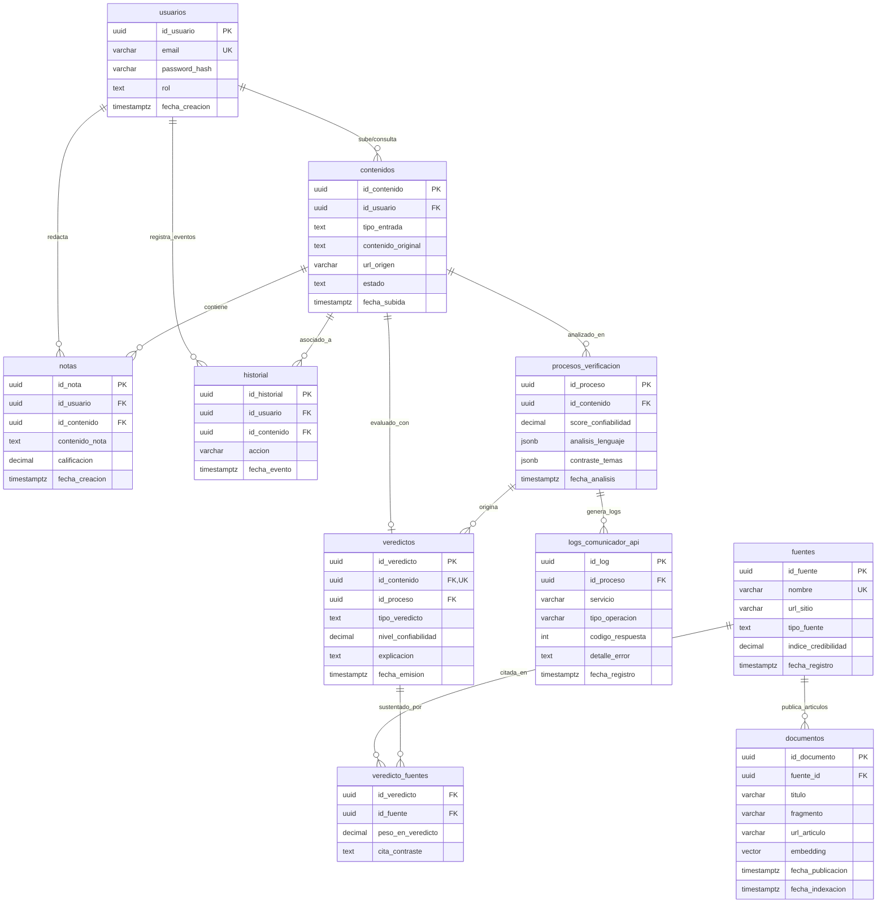

## Diagrama Entidad-Relación (DER)

```mermaid
erDiagram
    usuarios ||--o{ contenidos : "sube/consulta"
    usuarios ||--o{ notas : "redacta"
    usuarios ||--o{ historial : "registra_eventos"

    contenidos ||--o{ procesos_verificacion : "analizado_en"
    contenidos ||--o{ notas : "contiene"
    contenidos ||--o{ historial : "asociado_a"
    contenidos ||--o| veredictos : "evaluado_con"

    procesos_verificacion ||--o{ veredictos : "origina"
    procesos_verificacion ||--o{ logs_comunicador_api : "genera_logs"

    fuentes ||--o{ documentos : "publica_articulos"
    fuentes ||--o{ veredicto_fuentes : "citada_en"
    veredictos ||--o{ veredicto_fuentes : "sustentado_por"

    usuarios {
        uuid id_usuario PK
        varchar email UK
        varchar password_hash
        text rol
        timestamptz fecha_creacion
    }

    fuentes {
        uuid id_fuente PK
        varchar nombre UK
        varchar url_sitio
        text tipo_fuente
        decimal indice_credibilidad
        timestamptz fecha_registro
    }

    documentos {
        uuid id_documento PK
        uuid fuente_id FK
        varchar titulo
        varchar fragmento
        varchar url_articulo
        vector embedding
        timestamptz fecha_publicacion
        timestamptz fecha_indexacion
    }

    contenidos {
        uuid id_contenido PK
        uuid id_usuario FK
        text tipo_entrada
        text contenido_original
        varchar url_origen
        text estado
        timestamptz fecha_subida
    }

    procesos_verificacion {
        uuid id_proceso PK
        uuid id_contenido FK
        decimal score_confiabilidad
        jsonb analisis_lenguaje
        jsonb contraste_temas
        timestamptz fecha_analisis
    }

    veredictos {
        uuid id_veredicto PK
        uuid id_contenido FK,UK
        uuid id_proceso FK
        text tipo_veredicto
        decimal nivel_confiabilidad
        text explicacion
        timestamptz fecha_emision
    }

    veredicto_fuentes {
        uuid id_veredicto FK
        uuid id_fuente FK
        decimal peso_en_veredicto
        text cita_contraste
    }

    notas {
        uuid id_nota PK
        uuid id_usuario FK
        uuid id_contenido FK
        text contenido_nota
        decimal calificacion
        timestamptz fecha_creacion
    }

    historial {
        uuid id_historial PK
        uuid id_usuario FK
        uuid id_contenido FK
        varchar accion
        timestamptz fecha_evento
    }

    logs_comunicador_api {
        uuid id_log PK
        uuid id_proceso FK
        varchar servicio
        varchar tipo_operacion
        int codigo_respuesta
        text detalle_error
        timestamptz fecha_registro
    }
```

---