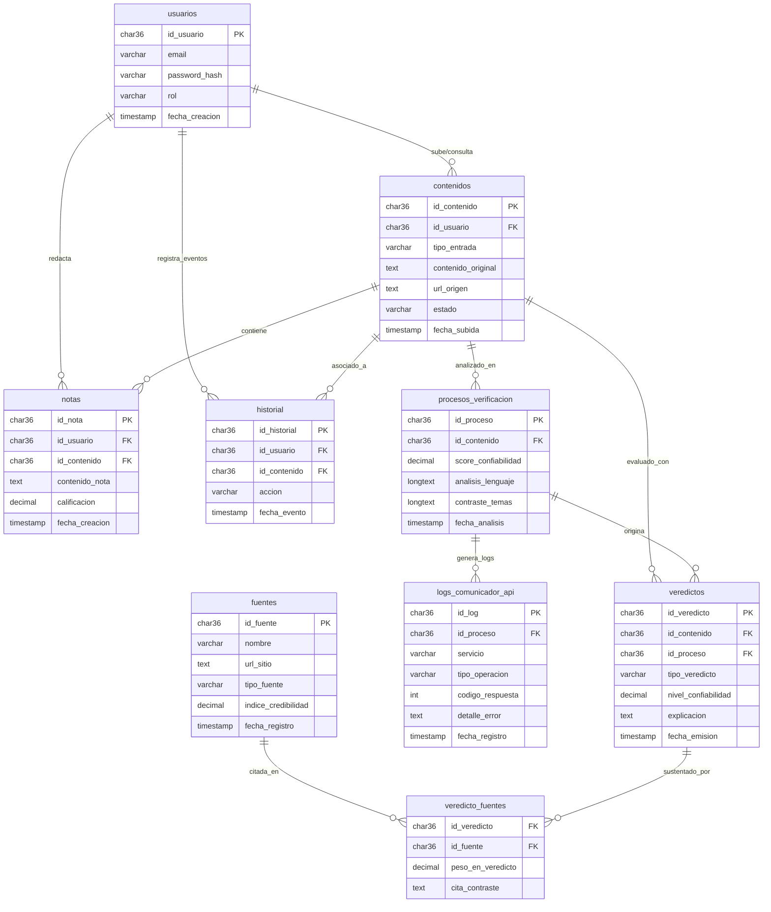

## Diseno Base de Datos

```mermaid
erDiagram
    usuarios ||--o{ contenidos : "sube/consulta"
    usuarios ||--o{ notas : "redacta"
    usuarios ||--o{ historial : "registra_eventos"

    contenidos ||--o{ procesos_verificacion : "analizado_en"
    contenidos ||--o{ notas : "contiene"
    contenidos ||--o{ historial : "asociado_a"
    contenidos ||--o{ veredictos : "evaluado_con"

    procesos_verificacion ||--o{ veredictos : "origina"
    procesos_verificacion ||--o{ logs_comunicador_api : "genera_logs"

    fuentes ||--o{ veredicto_fuentes : "citada_en"
    veredictos ||--o{ veredicto_fuentes : "sustentado_por"

    usuarios {
        char36 id_usuario PK
        varchar email
        varchar password_hash
        varchar rol
        timestamp fecha_creacion
    }

    contenidos {
        char36 id_contenido PK
        char36 id_usuario FK
        varchar tipo_entrada
        text contenido_original
        text url_origen
        varchar estado
        timestamp fecha_subida
    }

    procesos_verificacion {
        char36 id_proceso PK
        char36 id_contenido FK
        decimal score_confiabilidad
        longtext analisis_lenguaje
        longtext contraste_temas
        timestamp fecha_analisis
    }

    fuentes {
        char36 id_fuente PK
        varchar nombre
        text url_sitio
        varchar tipo_fuente
        decimal indice_credibilidad
        timestamp fecha_registro
    }

    veredictos {
        char36 id_veredicto PK
        char36 id_contenido FK
        char36 id_proceso FK
        varchar tipo_veredicto
        decimal nivel_confiabilidad
        text explicacion
        timestamp fecha_emision
    }

    veredicto_fuentes {
        char36 id_veredicto FK
        char36 id_fuente FK
        decimal peso_en_veredicto
        text cita_contraste
    }

    notas {
        char36 id_nota PK
        char36 id_usuario FK
        char36 id_contenido FK
        text contenido_nota
        decimal calificacion
        timestamp fecha_creacion
    }

    historial {
        char36 id_historial PK
        char36 id_usuario FK
        char36 id_contenido FK
        varchar accion
        timestamp fecha_evento
    }

    logs_comunicador_api {
        char36 id_log PK
        char36 id_proceso FK
        varchar servicio
        varchar tipo_operacion
        int codigo_respuesta
        text detalle_error
        timestamp fecha_registro
    }
```