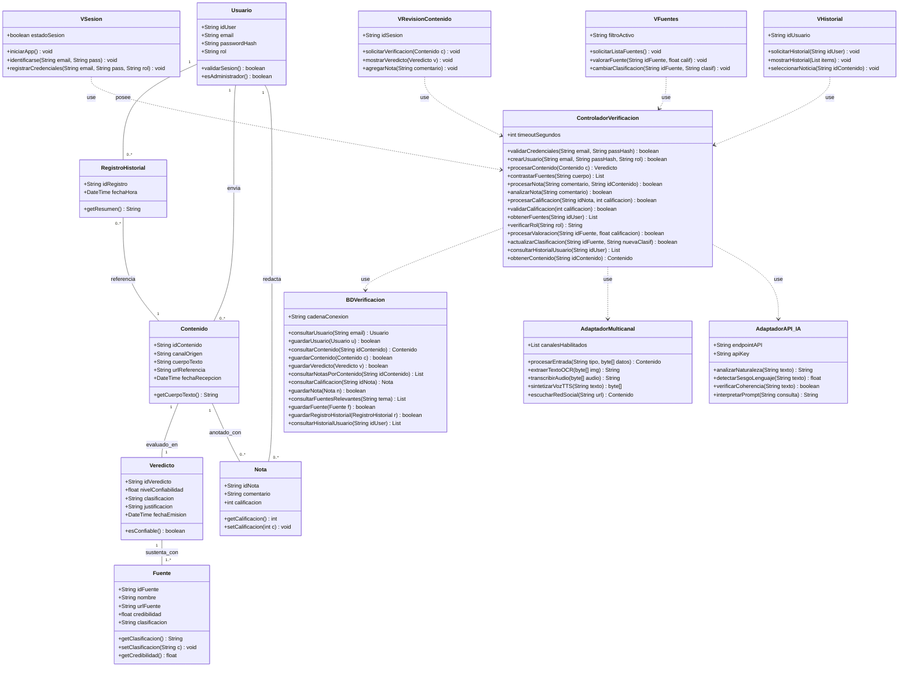

## Diagrama de Clases de Diseño (DCD)

```mermaid
classDiagram
    direction TB

    %% Modelos de Dominio
    class Usuario {
        +String idUser
        +String email
        +String passwordHash
        +String rol
        +validarSesion() boolean
        +esAdministrador() boolean
    }

    class Contenido {
        +String idContenido
        +String canalOrigen
        +String cuerpoTexto
        +String urlReferencia
        +DateTime fechaRecepcion
        +getCuerpoTexto() String
    }

    class Veredicto {
        +String idVeredicto
        +float nivelConfiabilidad
        +String clasificacion
        +String justificacion
        +DateTime fechaEmision
        +esConfiable() boolean
    }

    class Fuente {
        +String idFuente
        +String nombre
        +String urlFuente
        +float credibilidad
        +String clasificacion
        +getClasificacion() String
        +setClasificacion(String c) void
        +getCredibilidad() float
    }

    class Nota {
        +String idNota
        +String comentario
        +int calificacion
        +getCalificacion() int
        +setCalificacion(int c) void
    }

    class RegistroHistorial {
        +String idRegistro
        +DateTime fechaHora
        +getResumen() String
    }

    %% Capa de Control
    class ControladorVerificacion {
        +int timeoutSegundos
        +validarCredenciales(String email, String passHash) boolean
        +crearUsuario(String email, String passHash, String rol) boolean
        +procesarContenido(Contenido c) Veredicto
        +contrastarFuentes(String cuerpo) List
        +procesarNota(String comentario, String idContenido) boolean
        +analizarNota(String comentario) boolean
        +procesarCalificacion(String idNota, int calificacion) boolean
        +validarCalificacion(int calificacion) boolean
        +obtenerFuentes(String idUser) List
        +verificarRol(String rol) String
        +procesarValoracion(String idFuente, float calificacion) boolean
        +actualizarClasificacion(String idFuente, String nuevaClasif) boolean
        +consultarHistorialUsuario(String idUser) List
        +obtenerContenido(String idContenido) Contenido
    }

    %% Capa de Vistas / Boundary
    class VSesion {
        +boolean estadoSesion
        +iniciarApp() void
        +identificarse(String email, String pass) void
        +registrarCredenciales(String email, String pass, String rol) void
    }

    class VRevisionContenido {
        +String idSesion
        +solicitarVerificacion(Contenido c) void
        +mostrarVeredicto(Veredicto v) void
        +agregarNota(String comentario) void
    }

    class VFuentes {
        +String filtroActivo
        +solicitarListaFuentes() void
        +valorarFuente(String idFuente, float calif) void
        +cambiarClasificacion(String idFuente, String clasif) void
    }

    class VHistorial {
        +String idUsuario
        +solicitarHistorial(String idUser) void
        +mostrarHistorial(List items) void
        +seleccionarNoticia(String idContenido) void
    }

    %% Capa de Adaptadores e Infraestructura
    class BDVerificacion {
        +String cadenaConexion
        +consultarUsuario(String email) Usuario
        +guardarUsuario(Usuario u) boolean
        +consultarContenido(String idContenido) Contenido
        +guardarContenido(Contenido c) boolean
        +guardarVeredicto(Veredicto v) boolean
        +consultarNotasPorContenido(String idContenido) List
        +consultarCalificacion(String idNota) Nota
        +guardarNota(Nota n) boolean
        +consultarFuentesRelevantes(String tema) List
        +guardarFuente(Fuente f) boolean
        +guardarRegistroHistorial(RegistroHistorial r) boolean
        +consultarHistorialUsuario(String idUser) List
    }

    class AdaptadorMulticanal {
        +List canalesHabilitados
        +procesarEntrada(String tipo, byte[] datos) Contenido
        +extraerTextoOCR(byte[] img) String
        +transcribirAudio(byte[] audio) String
        +sintetizarVozTTS(String texto) byte[]
        +escucharRedSocial(String url) Contenido
    }

    class AdaptadorAPI_IA {
        +String endpointAPI
        +String apiKey
        +analizarNaturaleza(String texto) String
        +detectarSesgoLenguaje(String texto) float
        +verificarCoherencia(String texto) boolean
        +interpretarPrompt(String consulta) String
    }

    %% Relaciones de Dominio
    Usuario "1" -- "0..*" RegistroHistorial : posee
    Usuario "1" -- "0..*" Contenido : envia
    Usuario "1" -- "0..*" Nota : redacta
    Contenido "1" -- "1" Veredicto : evaluado_en
    Contenido "1" -- "0..*" Nota : anotado_con
    RegistroHistorial "0..*" -- "1" Contenido : referencia
    Veredicto "1" -- "1..*" Fuente : sustenta_con

    %% Relaciones de Uso (Vistas hacia Controlador)
    VSesion ..> ControladorVerificacion : use
    VRevisionContenido ..> ControladorVerificacion : use
    VFuentes ..> ControladorVerificacion : use
    VHistorial ..> ControladorVerificacion : use

    %% Relaciones de Uso (Controlador hacia Adaptadores)
    ControladorVerificacion ..> BDVerificacion : use
    ControladorVerificacion ..> AdaptadorMulticanal : use
    ControladorVerificacion ..> AdaptadorAPI_IA : use
```
