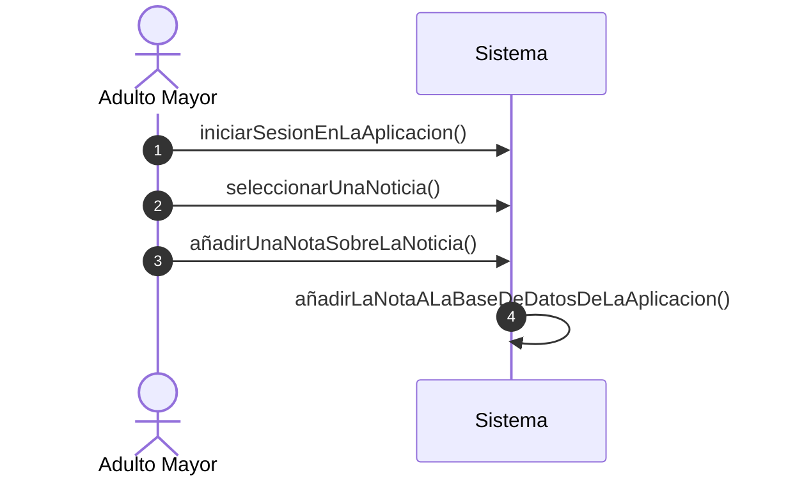

# Diagrama de Secuencia del Sistema (Caja Negra)
## CU01 — Asignar Notas

---

```mermaid
sequenceDiagram
    autonumber

    actor Adulto Mayor
    participant Sistema

    Adulto Mayor->>Sistema: iniciarSesionEnLaAplicacion()
    Adulto Mayor->>Sistema: seleccionarUnaNoticia()
    Adulto Mayor->>Sistema: añadirUnaNotaSobreLaNoticia()
    Sistema->>Sistema: añadirLaNotaALaBaseDeDatosDeLaAplicacion() 
```
