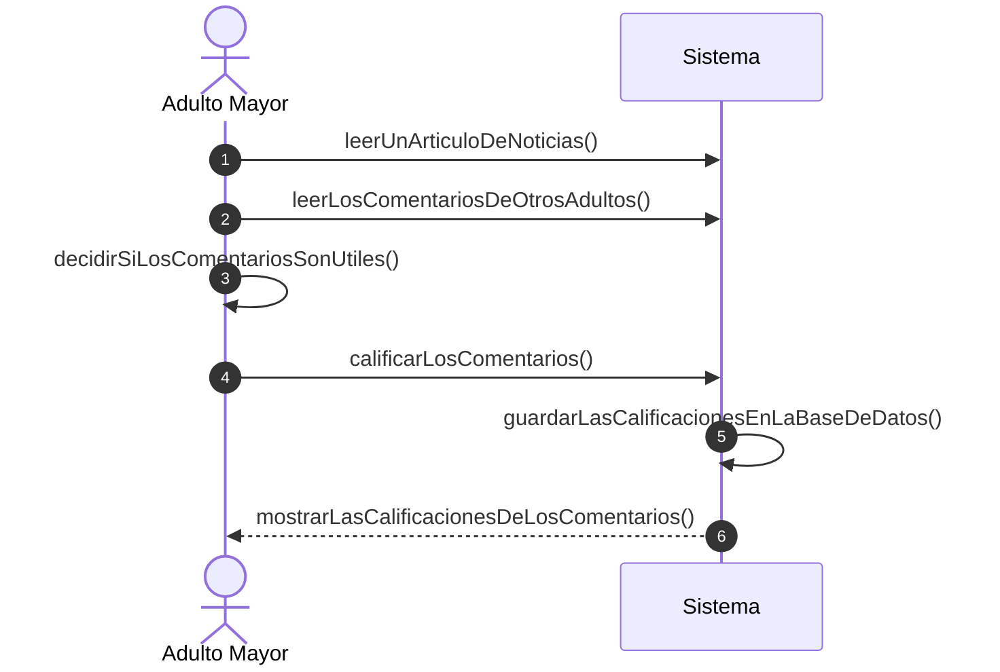

# Diagrama de Secuencia del Sistema (Caja Negra)
## CU02 — Calificar Notas

---

```mermaid
sequenceDiagram
    autonumber

    actor Adulto Mayor
    participant Sistema

    Adulto Mayor->>Sistema: leerUnArticuloDeNoticias()
    Adulto Mayor->>Sistema: leerLosComentariosDeOtrosAdultos()
    Adulto Mayor->>Adulto Mayor: decidirSiLosComentariosSonUtiles()
    Adulto Mayor->>Sistema: calificarLosComentarios()
    Sistema->>Sistema: guardarLasCalificacionesEnLaBaseDeDatos()
    Sistema-->>Adulto Mayor: mostrarLasCalificacionesDeLosComentarios()
```
