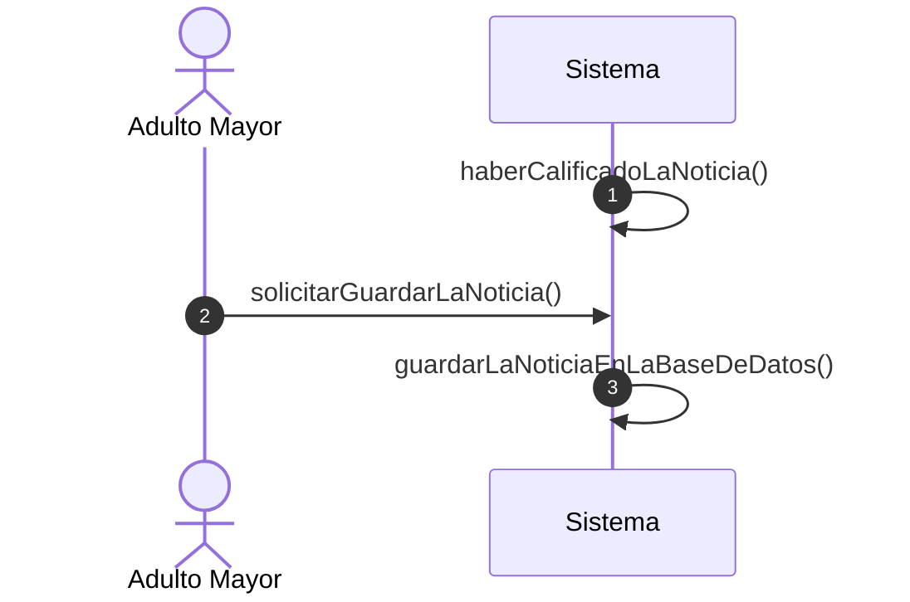

# Diagrama de Secuencia del Sistema (Caja Negra)
## CU03 — Guardar Contenidos

---

```mermaid
sequenceDiagram
    autonumber

    actor Adulto Mayor
    participant Sistema

    Sistema->>Sistema: haberCalificadoLaNoticia()
    Adulto Mayor->>Sistema: solicitarGuardarLaNoticia()
    Sistema->>Sistema: guardarLaNoticiaEnLaBaseDeDatos()
```
