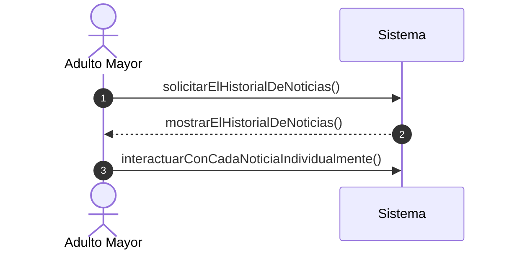

# Diagrama de Secuencia del Sistema (Caja Negra)
## CU04 — Historial Contenidos

---

```mermaid
sequenceDiagram
    autonumber

    actor Adulto Mayor
    participant Sistema

    Adulto Mayor->>Sistema: solicitarElHistorialDeNoticias()
    Sistema-->>Adulto Mayor: mostrarElHistorialDeNoticias()
    Adulto Mayor->>Sistema: interactuarConCadaNoticiaIndividualmente()
```
