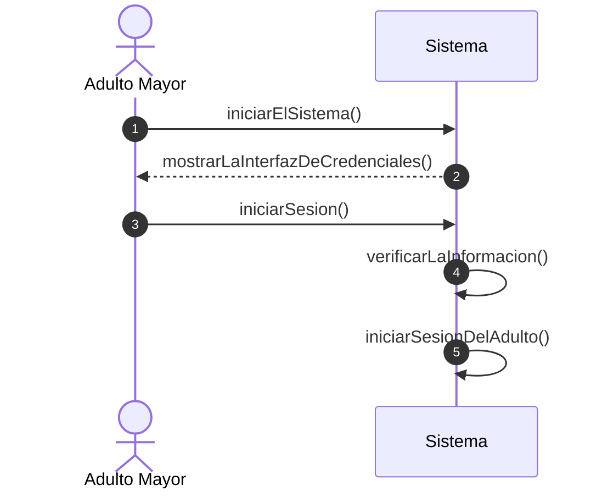

# Diagrama de Secuencia del Sistema (Caja Negra)
## CU05 — Inicio de Sesión

---

```mermaid
sequenceDiagram
    autonumber

    actor Adulto Mayor
    participant Sistema

    Adulto Mayor->>Sistema: iniciarElSistema()
    Sistema-->>Adulto Mayor: mostrarLaInterfazDeCredenciales()
    Adulto Mayor->>Sistema: iniciarSesion()
    Sistema->>Sistema: verificarLaInformacion()
    Sistema->>Sistema: iniciarSesionDelAdulto()
```
