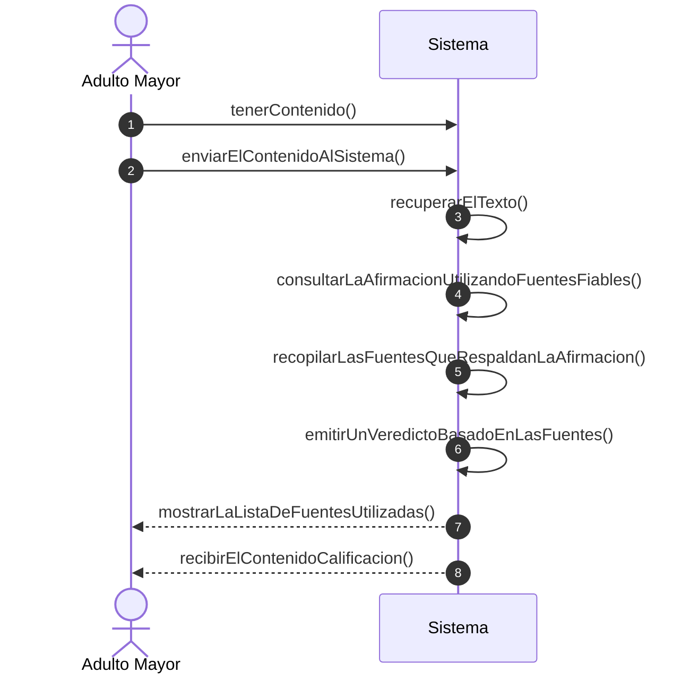

# Diagrama de Secuencia del Sistema (Caja Negra)
## CU06 — Verificar Contenidos

---

```mermaid
sequenceDiagram
    autonumber

    actor Adulto Mayor
    participant Sistema

    Adulto Mayor->>Sistema: tenerContenido()
    Adulto Mayor->>Sistema: enviarElContenidoAlSistema()
    Sistema->>Sistema: recuperarElTexto()
    Sistema->>Sistema: consultarLaAfirmacionUtilizandoFuentesFiables()
    Sistema->>Sistema: recopilarLasFuentesQueRespaldanLaAfirmacion()
    Sistema->>Sistema: emitirUnVeredictoBasadoEnLasFuentes()
    Sistema-->>Adulto Mayor: mostrarLaListaDeFuentesUtilizadas()
    Sistema-->>Adulto Mayor: recibirElContenidoCalificacion()
```
