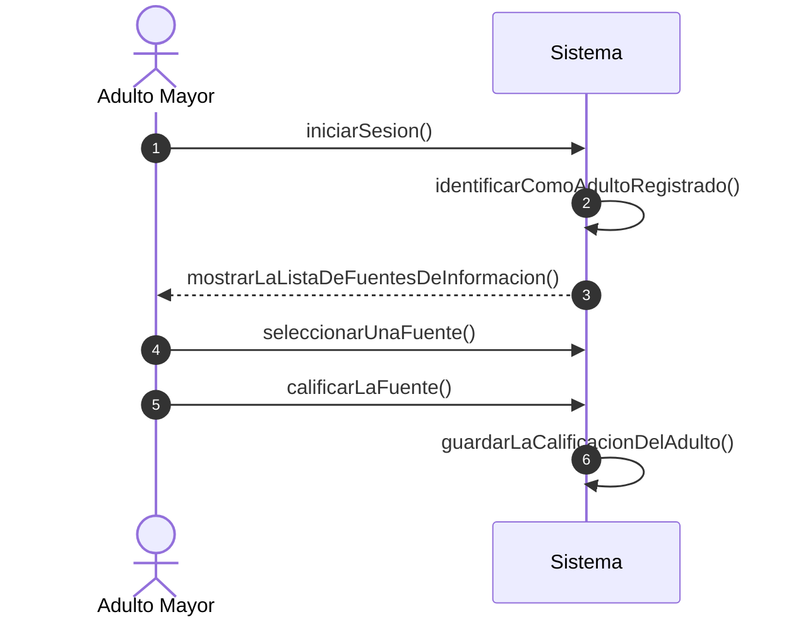

# Diagrama de Secuencia del Sistema (Caja Negra)
## CU07 — Asignar Confiabilidad a las Fuentes

---

```mermaid
sequenceDiagram
    autonumber

    actor Adulto Mayor
    participant Sistema

    Adulto Mayor->>Sistema: iniciarSesion()
    Sistema->>Sistema: identificarComoAdultoRegistrado()
    Sistema-->>Adulto Mayor: mostrarLaListaDeFuentesDeInformacion()
    Adulto Mayor->>Sistema: seleccionarUnaFuente()
    Adulto Mayor->>Sistema: calificarLaFuente()
    Sistema->>Sistema: guardarLaCalificacionDelAdulto()
```
